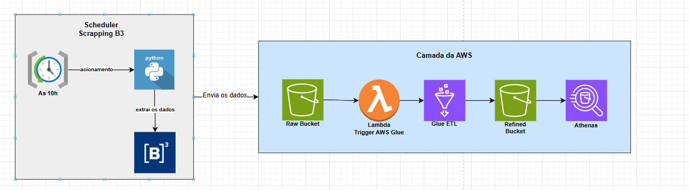

# 🚀 Pipeline Batch Bovespa

Este projeto implementa um **pipeline de dados completo** para **extração, processamento e análise de dados do pregão da B3**, utilizando **AWS S3, AWS Lambda, AWS Glue e AWS Athena**.

## 📌 Objetivo

Criar um fluxo de **ingestão e processamento de dados da B3**, permitindo que os dados brutos sejam extraídos, transformados e armazenados em um formato otimizado para análise no **Athena**.

## 📁 Arquitetura

O pipeline segue a arquitetura abaixo:

1. **Scraping dos dados da B3**: Um script Python coleta os dados do pregão em um job executado sempre as 10h.
2. **Armazenamento no S3 (Raw Bucket)**: Os dados brutos são salvos no S3 em formato Parquet, com partição diária.
3. **Trigger Lambda**: Ao detectar um novo arquivo no S3, uma Lambda é acionada.
4. **ETL com AWS Glue**: A Lambda inicia um job no Glue para processar os dados.
5. **Armazenamento dos dados refinados**: O Glue salva os dados no S3 (Refined Bucket), particionando por data e nome da ação.
6. **Consulta via AWS Athena**: Os dados são catalogados e podem ser consultados no Athena.



## 🛠 Tecnologias Utilizadas

- **Python**: Scripts de scraping, limpeza e formatação dos dados.
- **AWS S3**: Armazenamento dos dados brutos e refinados.
- **AWS Lambda**: Aciona o job de ETL no Glue.
- **AWS Glue**: Processa e transforma os dados.
- **AWS Athena**: Permite consultas SQL sobre os dados processados.

## 🏗 Estrutura do Projeto

```
📂 projeto-pipeline-bovespa
│── 📂 etl
│   ├️️ transform.py    # Limpeza e processamento dos dados
│── 📂 scraping
│   ├️️ scraper.py  # Coleta dados do site da B3
│── 📂 storage
│   ├️️ s3_manager.py   # Upload para o S3
│─ config.py  # Configurações do projeto
│─ main.py  # Agendamento e execução do processo
│─ requirements.txt  # Dependências do projeto
│─ README.md  # Documentação do projeto
```

## ⚙️ Configuração e Execução

### 1️⃣ **Instalar dependências**

```bash
pip install -r requirements.txt
```

### 2️⃣ **Rodar o scraper manualmente**

```bash
python main.py
```

### 3️⃣ **Executar a Lambda no AWS**

A função Lambda pode ser implementada na AWS para detectar novos arquivos no **S3** e iniciar o **Glue**.

### 4️⃣ **Consultar dados no Athena**

Após o processamento, os dados podem ser consultados no **AWS Athena**.

## ✅ Requisitos Atendidos

- ✔️ **Requisito 1**: Scraping de dados do site da B3.
- ✔️ **Requisito 2**: Upload dos dados brutos no S3 em formato Parquet, partição diária.
- ✔️ **Requisito 3**: O bucket deve acionar uma lambda, que por sua vez irá chamar o job de ETL no glue.
- ✔️ **Requisito 4**: Implementação da Lambda em Python.
- ✔️ **Requisito 5**: Job Glue configurado no modo visual com transformações obrigatórias.
- ✔️ **Requisito 6**: Dados refinados salvos em um bucket S3 chamado `refined/`.
- ✔️ **Requisito 7**: Glue Catalog usado para catalogar os dados.
- ✔️ **Requisito 8**: Dados disponíveis para consulta via Athena.
---

📌 **Desenvolvido para o Tech Challenge - Fase 2 - Machine Learning Avançado**🔗 **Fonte de dados:** [B3 - Índice IBOV](https://sistemaswebb3-listados.b3.com.br/indexPage/day/IBOV?language=pt-br)
